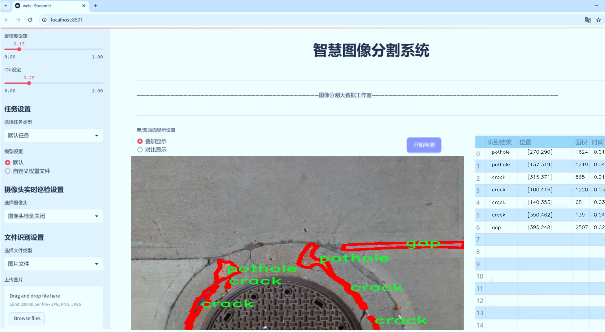
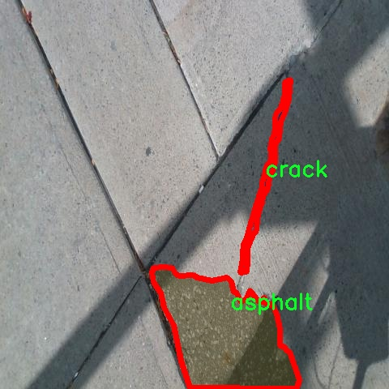

# 道路缺陷分割系统源码＆数据集分享
 [yolov8-seg-EfficientRepBiPAN＆yolov8-seg-AFPN-P345等50+全套改进创新点发刊_一键训练教程_Web前端展示]

### 1.研究背景与意义

项目参考[ILSVRC ImageNet Large Scale Visual Recognition Challenge](https://gitee.com/YOLOv8_YOLOv11_Segmentation_Studio/projects)

项目来源[AAAI Global Al lnnovation Contest](https://kdocs.cn/l/cszuIiCKVNis)

研究背景与意义

随着城市化进程的加快，交通基础设施的建设与维护显得尤为重要。道路作为城市交通的主要枢纽，其质量直接影响到交通安全与通行效率。然而，随着时间的推移，路面由于自然因素和交通荷载的影响，往往会出现各种缺陷，如裂缝、坑洞、间隙等。这些道路缺陷不仅影响了车辆的行驶安全，还可能导致交通事故的发生，给社会带来巨大的经济损失。因此，及时、准确地检测和分割道路缺陷，成为了道路维护管理中的一项重要任务。

近年来，深度学习技术的迅猛发展为计算机视觉领域带来了革命性的变化，尤其是在图像分割任务中表现出色。YOLO（You Only Look Once）系列模型以其高效的实时检测能力和良好的准确性，逐渐成为目标检测和分割任务中的主流选择。YOLOv8作为该系列的最新版本，进一步提升了模型的性能，适应了更复杂的应用场景。然而，现有的YOLOv8模型在道路缺陷分割任务中的应用仍存在一定的局限性，特别是在对细小缺陷的识别和分割精度方面。因此，基于改进YOLOv8的道路缺陷分割系统的研究具有重要的现实意义。

本研究将利用gapDet数据集，该数据集包含2400张图像，涵盖了五类道路缺陷，包括沥青、裂缝、间隙、物体和坑洞。这些类别的细分不仅有助于提高模型的分类精度，也为后续的道路维护提供了更加细致的数据支持。通过对这些缺陷进行有效的分割和识别，能够为道路管理部门提供实时的监测数据，帮助其制定科学合理的维护计划，降低道路事故的发生率，提高交通安全。

此外，研究中将对YOLOv8模型进行改进，针对道路缺陷的特征进行优化，以提高模型在分割任务中的表现。通过引入多尺度特征融合、注意力机制等先进技术，期望能够增强模型对细小缺陷的敏感性和分割精度。这不仅有助于提升模型的性能，也为相关领域的研究提供了新的思路和方法。

综上所述，基于改进YOLOv8的道路缺陷分割系统的研究，不仅能够为道路维护提供有效的技术支持，还能推动计算机视觉技术在实际应用中的发展。通过实现高效、准确的道路缺陷检测与分割，能够为提升城市交通基础设施的安全性和可靠性做出积极贡献。此项研究的开展，必将为道路管理的智能化、精细化提供有力的支撑，具有重要的学术价值和应用前景。

### 2.图片演示





##### 注意：由于此博客编辑较早，上面“2.图片演示”和“3.视频演示”展示的系统图片或者视频可能为老版本，新版本在老版本的基础上升级如下：（实际效果以升级的新版本为准）

  （1）适配了YOLOV8的“目标检测”模型和“实例分割”模型，通过加载相应的权重（.pt）文件即可自适应加载模型。

  （2）支持“图片识别”、“视频识别”、“摄像头实时识别”三种识别模式。

  （3）支持“图片识别”、“视频识别”、“摄像头实时识别”三种识别结果保存导出，解决手动导出（容易卡顿出现爆内存）存在的问题，识别完自动保存结果并导出到tempDir中。

  （4）支持Web前端系统中的标题、背景图等自定义修改，后面提供修改教程。

  另外本项目提供训练的数据集和训练教程,暂不提供权重文件（best.pt）,需要您按照教程进行训练后实现图片演示和Web前端界面演示的效果。

### 3.视频演示

[3.1 视频演示](https://www.bilibili.com/video/BV1DC2iYGEGp/)

### 4.数据集信息展示

##### 4.1 本项目数据集详细数据（类别数＆类别名）

nc: 4
names: ['asphalt', 'crack', 'gap', 'pothole']


##### 4.2 本项目数据集信息介绍

数据集信息展示

在现代道路维护与管理中，准确识别和分类道路缺陷是确保交通安全和延长道路使用寿命的关键。为此，本研究选用了名为“gapDet”的数据集，以支持改进YOLOv8-seg的道路缺陷分割系统。该数据集专注于道路表面的不同缺陷，提供了丰富的标注信息，旨在为深度学习模型的训练提供高质量的数据支持。

“gapDet”数据集包含四个主要类别，分别是“asphalt”（沥青）、“crack”（裂缝）、“gap”（缝隙）和“pothole”（坑洞）。这些类别涵盖了道路表面常见的缺陷类型，每种缺陷都可能对行车安全造成不同程度的影响。例如，沥青的质量直接关系到道路的平整度和耐用性，而裂缝和缝隙则可能导致车辆的颠簸和损坏，坑洞则是最为严重的缺陷，可能引发交通事故。因此，准确地识别和分类这些缺陷，对于及时维护和修复道路至关重要。

在数据集的构建过程中，研究团队采用了多种数据采集技术，包括高分辨率摄像头和激光扫描设备，以确保捕捉到的图像具有足够的清晰度和细节。这些图像经过精心标注，确保每个缺陷类别都能被准确识别。数据集中的每一张图像都配有相应的标注文件，详细记录了缺陷的类别、位置和尺寸等信息。这种精细的标注方式为YOLOv8-seg模型的训练提供了坚实的基础，使其能够在实际应用中实现高效的缺陷检测与分割。

“gapDet”数据集的设计不仅考虑了缺陷的多样性，还兼顾了不同环境和光照条件下的图像采集。这意味着数据集中包含了在不同天气、时间和路况下拍摄的图像，从而增强了模型的泛化能力。通过这样的多样性，YOLOv8-seg模型能够更好地适应实际应用场景，提高道路缺陷检测的准确性和鲁棒性。

此外，数据集的使用还可以促进相关领域的研究与发展。随着智能交通系统的不断进步，如何利用深度学习技术实现自动化的道路维护和管理，已成为一个重要的研究方向。通过对“gapDet”数据集的深入分析和应用，研究人员可以探索更为先进的算法和模型，推动道路缺陷检测技术的创新与进步。

总之，“gapDet”数据集为改进YOLOv8-seg的道路缺陷分割系统提供了丰富的训练素材和坚实的理论基础。其涵盖的四个类别不仅反映了道路缺陷的多样性，也为模型的训练和评估提供了全面的视角。通过充分利用这一数据集，研究团队期望能够实现更高效、更准确的道路缺陷检测，进而为道路安全和维护管理提供有力支持。





### 5.全套项目环境部署视频教程（零基础手把手教学）

[5.1 环境部署教程链接（零基础手把手教学）](https://www.bilibili.com/video/BV1jG4Ve4E9t/?vd_source=bc9aec86d164b67a7004b996143742dc)


[5.2 安装Python虚拟环境创建和依赖库安装视频教程链接（零基础手把手教学）](https://www.bilibili.com/video/BV1nA4VeYEze/?vd_source=bc9aec86d164b67a7004b996143742dc)

### 6.手把手YOLOV8-seg训练视频教程（零基础小白有手就能学会）

[6.1 手把手YOLOV8-seg训练视频教程（零基础小白有手就能学会）](https://www.bilibili.com/video/BV1cA4VeYETe/?vd_source=bc9aec86d164b67a7004b996143742dc)


按照上面的训练视频教程链接加载项目提供的数据集，运行train.py即可开始训练



     Epoch   gpu_mem       box       obj       cls    labels  img_size
     1/200     0G   0.01576   0.01955  0.007536        22      1280: 100%|██████████| 849/849 [14:42<00:00,  1.04s/it]
               Class     Images     Labels          P          R     mAP@.5 mAP@.5:.95: 100%|██████████| 213/213 [01:14<00:00,  2.87it/s]
                 all       3395      17314      0.994      0.957      0.0957      0.0843

     Epoch   gpu_mem       box       obj       cls    labels  img_size
     2/200     0G   0.01578   0.01923  0.007006        22      1280: 100%|██████████| 849/849 [14:44<00:00,  1.04s/it]
               Class     Images     Labels          P          R     mAP@.5 mAP@.5:.95: 100%|██████████| 213/213 [01:12<00:00,  2.95it/s]
                 all       3395      17314      0.996      0.956      0.0957      0.0845

     Epoch   gpu_mem       box       obj       cls    labels  img_size
     3/200     0G   0.01561    0.0191  0.006895        27      1280: 100%|██████████| 849/849 [10:56<00:00,  1.29it/s]
               Class     Images     Labels          P          R     mAP@.5 mAP@.5:.95: 100%|███████   | 187/213 [00:52<00:00,  4.04it/s]
                 all       3395      17314      0.996      0.957      0.0957      0.0845


### 7.50+种全套YOLOV8-seg创新点代码加载调参视频教程（一键加载写好的改进模型的配置文件）

[7.1 50+种全套YOLOV8-seg创新点代码加载调参视频教程（一键加载写好的改进模型的配置文件）](https://www.bilibili.com/video/BV1Hw4VePEXv/?vd_source=bc9aec86d164b67a7004b996143742dc)

### 8.YOLOV8-seg图像分割算法原理

原始YOLOv8-seg算法原理

YOLOv8-seg算法是YOLO系列目标检测算法的最新进展，标志着目标检测领域在精度和速度上的进一步提升。作为一种一阶段目标检测算法，YOLOv8-seg在YOLOv8的基础上进行了重要的扩展，特别是在图像分割任务中表现出色。该算法不仅能够有效地检测目标，还能对目标进行精确的像素级分割，从而为各种应用场景提供了更为细致的分析能力。

YOLOv8-seg的网络结构由三个主要部分组成：Backbone（主干网络）、Neck（颈部结构）和Head（头部结构）。主干网络负责特征提取，通常采用CSPNet（Cross Stage Partial Network）架构，这种设计能够有效地提高特征提取的效率和准确性。CSPNet通过将特征图分成多个部分并进行交叉连接，减少了计算量的同时保留了丰富的特征信息，从而为后续的特征融合和目标检测奠定了基础。

在Neck部分，YOLOv8-seg采用了PAN-FPN（Path Aggregation Network - Feature Pyramid Network）结构，这种结构能够在不同尺度的特征图之间进行有效的融合，确保模型在处理多尺度目标时的鲁棒性。PAN-FPN通过自底向上的路径聚合特征，结合自顶向下的特征传递，能够更好地捕捉到图像中的上下文信息。这一设计使得YOLOv8-seg在面对复杂场景时，能够更准确地识别和分割目标。

YOLOv8-seg的Head部分则是其创新之处，采用了解耦头的设计，将目标分类和边界框回归任务分开处理。这种解耦的方式使得模型能够更加专注于每个任务，减少了任务之间的干扰，从而提高了整体的检测精度。在YOLOv8-seg中，解耦头不仅支持目标检测，还引入了分割分支，能够实现像素级的目标分割。这一创新使得YOLOv8-seg在处理需要高精度分割的任务时，表现得尤为出色。

与传统的目标检测算法相比，YOLOv8-seg在设计上引入了Anchor-free目标检测方法。这种方法不再依赖于预定义的锚框，而是通过回归的方式直接预测目标的位置和大小。这一改变大大简化了模型的设计，避免了锚框选择和调整的繁琐过程，使得模型在不同尺度和形状的目标上都能快速适应。这种灵活性不仅提高了检测速度，还增强了模型在复杂场景下的适应能力。

YOLOv8-seg的训练过程也经过了优化，采用了多尺度训练和测试策略，以提高模型的泛化能力。在训练过程中，模型会在不同尺度的图像上进行训练，使得它能够更好地适应不同大小的目标。此外，YOLOv8-seg还支持自定义数据集的训练，这一特性使得用户能够根据具体应用场景进行模型的调整和优化，从而提高检测和分割的效果。

在实际应用中，YOLOv8-seg展现出了极高的灵活性和适用性。无论是在智能监控、自动驾驶，还是在医学影像分析等领域，YOLOv8-seg都能够提供实时且高精度的目标检测和分割服务。其高效的推理速度和准确的检测能力，使得它成为了许多实时应用的理想选择。

总的来说，YOLOv8-seg算法在YOLOv8的基础上，通过引入解耦头、Anchor-free检测方法以及PAN-FPN特征融合结构，极大地提升了目标检测和分割的性能。其灵活的训练策略和广泛的应用场景，使得YOLOv8-seg在目标检测领域中占据了重要的地位，成为了研究人员和工程师们关注的焦点。随着YOLOv8-seg的不断发展和完善，未来在更复杂的应用场景中，其潜力将会得到进一步的挖掘和发挥。


### 9.系统功能展示（检测对象为举例，实际内容以本项目数据集为准）

图9.1.系统支持检测结果表格显示

  图9.2.系统支持置信度和IOU阈值手动调节

  图9.3.系统支持自定义加载权重文件best.pt(需要你通过步骤5中训练获得)

  图9.4.系统支持摄像头实时识别

  图9.5.系统支持图片识别

  图9.6.系统支持视频识别

  图9.7.系统支持识别结果文件自动保存

  图9.8.系统支持Excel导出检测结果数据


### 10.50+种全套YOLOV8-seg创新点原理讲解（非科班也可以轻松写刊发刊，V11版本正在科研待更新）

#### 10.1 由于篇幅限制，每个创新点的具体原理讲解就不一一展开，具体见下列网址中的创新点对应子项目的技术原理博客网址【Blog】：


[10.1 50+种全套YOLOV8-seg创新点原理讲解链接](https://gitee.com/qunmasj/good)

#### 10.2 部分改进模块原理讲解(完整的改进原理见上图和技术博客链接)【如果此小节的图加载失败可以通过CSDN或者Github搜索该博客的标题访问原始博客，原始博客图片显示正常】
### YOLOv8模型原理

YOLOv8是YOLO系列最新的模型,具有非常优秀的检测精度和速度。根据网络的深度与特征图的宽度大小, YOLOv8算法分为:YOLOv8-n、YOLOv8一s 、YOLOv8-m 、 YOLOv8-l、和 YOLOv8-x 5个版本。按照网络结构图,YOLOv8可分为: Inpul 、 Backbone , Neck和Head 4部分。


Backbone采用了CSPDarknet 架构，由CBS (标准卷积层)、C2f模块和 SPPF(金字塔池化）组成。通过5次标准卷积层和C2f模块逐步提取图像特征，并在网络末尾添加SPPF模块，将任意大小的输入图像转换成固定大小的特征向量。分别取P3、P4、P5层的特征提取结果，向Head输出80×80、40 × 40、20×20三个尺度的特征层。
C2f模块借鉴了残差网络(ResNet)以及ELAN的思想，其结构分为两个分支，主干部分利用Bottleneckm2%模块逐步加深网络，分支部分保留输入层通道并与主干部分特征进行融合，如图所示。通过标准卷积层提取新的特征层，相比于YOLOv5使用的C3模块，C2f模块可以在卷积层和全连接层之间建立一个平滑的转换，从而实现了参数的共享，提高了模型的效率和泛化能力。
Head采用了PAN-FPN 结构,将 Backbone输入的3个特征层进行多尺度融合，进行自顶向下(FAN)和自底向上 (PAN)的特征传递，对金字塔进行增强，使不同尺寸的特征图都包含强目标语义信息和强目标特征信息，保证了对不同尺寸样本的准确预测。
Detect借鉴了Decoupled-Head 思想，用一个解耦检测头将输入的不同尺寸特征层分成2个分支进行检测。第1个分支在进行3次卷积后使进行回归任务，输出预测框。第2个分支在进行3次卷积后进行分类任务，输出类别的概率。采用Varifocal_Loss2”作为损失函数，其式为:


### Context_Grided_Network(CGNet)简介
参考该博客提出的一种轻量化语义分割模型Context Grided Network(CGNet)，以满足设备的运行需要。

CGNet主要由CG块构建而成，CG块可以学习局部特征和周围环境上下文的联合特征，最后通过引入全局上下文特征进一步改善联合特征的学习。


 
下图给出了在Cityscapes数据集上对现有的一些语义分割模型的测试效果，横轴表示参数量，纵轴表示准确率(mIoU)。可以看出，在参数量较少的情况下，CGNet可以达到一个比较好的准确率。虽与高精度模型相去甚远，但在一些对精度要求不高、对实时性要求比较苛刻的情况下，很有价值。


高精度模型，如DeepLab、DFN、DenseASPP等，动不动就是几十M的参数，很难应用在移动设备上。而上图中红色的模型，相对内存占用较小，但它们的分割精度却不是很高。作者认为主要原因是，这些小网络大多遵循着分类网络的设计思路，并没有考虑语义分割任务更深层次的特点。

空间依赖性和上下文信息对提高分割精度有很大的作用。作者从该角度出发，提出了CG block，并进一步搭建了轻量级语义分割网络CGNet。CG块具有以下特点： 

学习局部特征和上下文特征的联合特征；
通过全局上下文特征改进上述联合特征；
可以贯穿应用在整个网络中，从low level（空间级别）到high level（语义级别）。不像PSPNet、DFN、DenseASPP等，只在编码阶段以后捕捉上下文特征。；
只有3个下采样，相比一般5个下采样的网络，能够更好地保留边缘信息。
CGNet遵循“深而薄”的原则设计，整个网络又51层构成。其中，为了降低计算，大量使用了channel-wise conv.

小型语义分割模型：

需要平衡准确率和系统开销
进化路线：ENet -> ICNet -> ESPNet
这些模型基本都基于分类网络设计，在分割准确率上效果并不是很好
上下文信息模型：

大多数现有模型只考虑解码阶段的上下文信息并且没有利用周围的上下文信息
注意力机制：

CG block使用全局上下文信息计算权重向量，并使用其细化局部特征和周围上下文特征的联合特征

#### Context Guided Block
CG block由4部分组成：


此外，CG block还采用了残差学习。文中提出了局部残差学习（LRL）和全局残差学习（GRL）两种方式。 LRL添加了从输入到联合特征提取器的连接，GRL添加了从输入到全局特征提取器的连接。从直观上来说，GRL比LRL更能促进网络中的信息传递（更像ResNet~~），后面实验部分也进行了测试，的确GRL更能提升分割精度。


CGNet的通用网络结构如下图所示，分为3个stage，第一个stage使用3个卷积层抽取特征，第二和第三个stage堆叠一定数量的CG block，具体个数可以根据情况调整。最后，通过1x1 conv得到分割结果。


下图是用于Cityscapes数据集的CGNet网络细节说明：输入尺寸为3*680*680；stage1连续使用了3个Conv-BN-PReLU组合，首个组合使用了stride=2的卷积，所以得到了1/2分辨率的feature map；stage2和stage3分别使用了多个CG block，且其中使用了不同大小的膨胀卷积核，最终分别得到了1/4和1/8的feature map。

需注意：

stage2&3的输入特征分别由其上一个stage的首个和最后一个block组合给出（参考上图的绿色箭头）；

输入注入机制，图中未体现，实际使用中，作者还将输入图像下采样1/4或1/8，分别给到stage2和stage3的输入中 ，以进一步加强特征传递。

channel-wise conv。为了缩减参数数量，在局部特征提取器和周围上下文特征提取器中使用了channel-wise卷积，可以消除跨通道的计算成本，同时节省内存占用。但是，没有像MobileNet等模型一样，在depth-wise卷积后面接point-wise卷积（1*1 conv），作者解释是，因为CG block需要保持局部特征和周围上下文特征的独立性，而1*1 conv会破坏这种独立性，所以效果欠佳，实验部分也进行了验证。

个人感觉此处应该指的是depth-wise卷积？

官方Git中对该部分的实现如下：


### 11.项目核心源码讲解（再也不用担心看不懂代码逻辑）

#### 11.1 ultralytics\nn\extra_modules\ops_dcnv3\setup.py

以下是对给定代码的核心部分进行提炼和详细注释的结果：

```python
# --------------------------------------------------------
# InternImage
# Copyright (c) 2022 OpenGVLab
# Licensed under The MIT License [see LICENSE for details]
# --------------------------------------------------------

import os
import glob
import torch
from torch.utils.cpp_extension import CUDA_HOME, CppExtension, CUDAExtension
from setuptools import find_packages, setup

# 定义所需的Python包
requirements = ["torch", "torchvision"]

def get_extensions():
    # 获取当前文件目录
    this_dir = os.path.dirname(os.path.abspath(__file__))
    # 定义扩展源代码目录
    extensions_dir = os.path.join(this_dir, "src")

    # 查找主C++文件和CPU/CUDA源文件
    main_file = glob.glob(os.path.join(extensions_dir, "*.cpp"))
    source_cpu = glob.glob(os.path.join(extensions_dir, "cpu", "*.cpp"))
    source_cuda = glob.glob(os.path.join(extensions_dir, "cuda", "*.cu"))

    # 将主文件和CPU源文件合并
    sources = main_file + source_cpu
    extension = CppExtension  # 默认使用C++扩展
    extra_compile_args = {"cxx": []}  # 额外编译参数
    define_macros = []  # 定义宏

    # 检查CUDA是否可用
    if torch.cuda.is_available() and CUDA_HOME is not None:
        extension = CUDAExtension  # 使用CUDA扩展
        sources += source_cuda  # 添加CUDA源文件
        define_macros += [("WITH_CUDA", None)]  # 定义CUDA宏
        extra_compile_args["nvcc"] = []  # 可以添加CUDA编译参数
    else:
        raise NotImplementedError('Cuda is not available')  # 如果CUDA不可用，抛出异常

    # 生成完整的源文件路径
    sources = [os.path.join(extensions_dir, s) for s in sources]
    include_dirs = [extensions_dir]  # 包含目录

    # 创建扩展模块
    ext_modules = [
        extension(
            "DCNv3",  # 扩展模块名称
            sources,  # 源文件列表
            include_dirs=include_dirs,  # 包含目录
            define_macros=define_macros,  # 定义的宏
            extra_compile_args=extra_compile_args,  # 额外编译参数
        )
    ]
    return ext_modules  # 返回扩展模块列表

# 设置包信息
setup(
    name="DCNv3",  # 包名称
    version="1.1",  # 包版本
    author="InternImage",  # 作者
    url="https://github.com/OpenGVLab/InternImage",  # 项目链接
    description="PyTorch Wrapper for CUDA Functions of DCNv3",  # 描述
    packages=find_packages(exclude=("configs", "tests")),  # 查找包，排除特定目录
    ext_modules=get_extensions(),  # 获取扩展模块
    cmdclass={"build_ext": torch.utils.cpp_extension.BuildExtension},  # 自定义构建扩展命令
)
```

### 代码分析与注释

1. **导入必要的库**：
   - `os` 和 `glob` 用于文件和目录操作。
   - `torch` 是PyTorch库，提供深度学习功能。
   - `torch.utils.cpp_extension` 提供C++和CUDA扩展的支持。
   - `setuptools` 用于打包和分发Python项目。

2. **`get_extensions` 函数**：
   - 该函数负责查找源代码文件并构建PyTorch的C++/CUDA扩展。
   - 使用 `glob` 模块查找指定目录下的所有C++和CUDA源文件。
   - 根据CUDA的可用性选择使用 `CppExtension` 或 `CUDAExtension`。
   - 生成扩展模块所需的所有参数，并返回扩展模块列表。

3. **`setup` 函数**：
   - 该函数定义了包的元数据和构建信息。
   - 包括名称、版本、作者、描述、需要的包、扩展模块等信息。

这个代码主要用于构建一个PyTorch的扩展模块，允许用户在PyTorch中使用自定义的CUDA功能。

这个 `setup.py` 文件是用于配置和构建一个名为 `DCNv3` 的 Python 扩展模块，主要是为 PyTorch 提供 CUDA 函数的封装。文件的开头包含了一些版权信息和许可证声明，表明该代码的版权归 OpenGVLab 所有，并且遵循 MIT 许可证。

首先，文件导入了一些必要的模块，包括 `os` 和 `glob` 用于文件路径处理，`torch` 用于深度学习框架的功能，`setuptools` 用于打包和分发 Python 包。此外，还从 `torch.utils.cpp_extension` 导入了 `CUDA_HOME`、`CppExtension` 和 `CUDAExtension`，这些是用于编译 C++ 和 CUDA 扩展的工具。

接下来，定义了一个 `requirements` 列表，列出了该模块所依赖的 Python 包，这里包括 `torch` 和 `torchvision`。

函数 `get_extensions()` 的主要功能是收集需要编译的源文件并配置扩展模块。首先，它获取当前文件的目录，并构建出包含源文件的路径。然后，通过 `glob` 模块查找主文件、CPU 和 CUDA 源文件，分别存储在 `main_file`、`source_cpu` 和 `source_cuda` 列表中。

在构建源文件列表时，默认使用 `CppExtension`，并初始化一些编译参数和宏定义。如果检测到 CUDA 可用，且 `CUDA_HOME` 不为 `None`，则切换到使用 `CUDAExtension`，并将 CUDA 源文件添加到源文件列表中，同时定义了一个宏 `WITH_CUDA`。如果 CUDA 不可用，则抛出一个 `NotImplementedError`，提示用户 CUDA 不可用。

所有的源文件路径都被转换为绝对路径，并设置了包含目录。最后，创建了一个扩展模块的列表 `ext_modules`，其中包含了模块的名称、源文件、包含目录、宏定义和编译参数。

在文件的最后，调用 `setup()` 函数来配置包的元数据，包括包的名称、版本、作者、项目网址、描述信息，以及要排除的包（如 `configs` 和 `tests`）。同时，将通过 `get_extensions()` 函数获取的扩展模块传递给 `ext_modules` 参数，并指定 `cmdclass` 为 `torch.utils.cpp_extension.BuildExtension`，以便在构建时使用 PyTorch 的扩展构建工具。

总的来说，这个 `setup.py` 文件是一个典型的用于构建 PyTorch C++/CUDA 扩展的配置文件，旨在提供高效的深度学习功能。

#### 11.2 ultralytics\utils\instance.py

以下是经过简化和注释的核心代码部分，主要集中在 `Bboxes` 和 `Instances` 类的实现上：

```python
import numpy as np

class Bboxes:
    """
    处理边界框的类，支持多种格式（'xyxy', 'xywh', 'ltwh'）。
    """

    def __init__(self, bboxes, format='xyxy') -> None:
        """初始化 Bboxes 类，接收边界框数据和格式。"""
        # 确保格式有效
        assert format in ['xyxy', 'xywh', 'ltwh'], f'无效的边界框格式: {format}'
        # 将一维数组转换为二维数组
        bboxes = bboxes[None, :] if bboxes.ndim == 1 else bboxes
        assert bboxes.ndim == 2 and bboxes.shape[1] == 4  # 确保是二维且每个框有4个坐标
        self.bboxes = bboxes  # 存储边界框
        self.format = format  # 存储格式

    def convert(self, format):
        """转换边界框格式。"""
        assert format in ['xyxy', 'xywh', 'ltwh'], f'无效的边界框格式: {format}'
        if self.format == format:
            return  # 如果格式相同，则不需要转换
        # 根据当前格式和目标格式选择转换函数
        func = self._get_conversion_function(format)
        self.bboxes = func(self.bboxes)  # 执行转换
        self.format = format  # 更新格式

    def _get_conversion_function(self, format):
        """根据当前格式和目标格式返回相应的转换函数。"""
        if self.format == 'xyxy':
            return xyxy2xywh if format == 'xywh' else xyxy2ltwh
        elif self.format == 'xywh':
            return xywh2xyxy if format == 'xyxy' else xywh2ltwh
        else:
            return ltwh2xyxy if format == 'xyxy' else ltwh2xywh

    def areas(self):
        """计算并返回每个边界框的面积。"""
        self.convert('xyxy')  # 转换为 'xyxy' 格式以计算面积
        return (self.bboxes[:, 2] - self.bboxes[:, 0]) * (self.bboxes[:, 3] - self.bboxes[:, 1])  # 计算面积

    def __len__(self):
        """返回边界框的数量。"""
        return len(self.bboxes)

class Instances:
    """
    存储图像中检测到的对象的边界框、分段和关键点的容器。
    """

    def __init__(self, bboxes, segments=None, keypoints=None, bbox_format='xywh', normalized=True) -> None:
        """初始化 Instances 类，接收边界框、分段和关键点数据。"""
        self._bboxes = Bboxes(bboxes=bboxes, format=bbox_format)  # 初始化边界框
        self.keypoints = keypoints  # 存储关键点
        self.normalized = normalized  # 标记是否归一化

        # 处理分段数据
        if segments is None:
            segments = []
        self.segments = self._process_segments(segments)

    def _process_segments(self, segments):
        """处理分段数据，确保其形状正确。"""
        if len(segments) > 0:
            segments = resample_segments(segments)  # 重采样分段
            return np.stack(segments, axis=0)  # 转换为3D数组
        return np.zeros((0, 1000, 2), dtype=np.float32)  # 返回空数组

    def convert_bbox(self, format):
        """转换边界框格式。"""
        self._bboxes.convert(format=format)

    @property
    def bbox_areas(self):
        """计算边界框的面积。"""
        return self._bboxes.areas()

    def scale(self, scale_w, scale_h, bbox_only=False):
        """缩放边界框、分段和关键点。"""
        self._bboxes.mul(scale=(scale_w, scale_h, scale_w, scale_h))  # 缩放边界框
        if not bbox_only:
            self._scale_segments_and_keypoints(scale_w, scale_h)  # 同时缩放分段和关键点

    def _scale_segments_and_keypoints(self, scale_w, scale_h):
        """缩放分段和关键点。"""
        self.segments[..., 0] *= scale_w
        self.segments[..., 1] *= scale_h
        if self.keypoints is not None:
            self.keypoints[..., 0] *= scale_w
            self.keypoints[..., 1] *= scale_h

    def __len__(self):
        """返回实例的数量。"""
        return len(self._bboxes)

    @property
    def bboxes(self):
        """返回边界框。"""
        return self._bboxes.bboxes
```

### 代码注释说明
1. **Bboxes 类**: 该类用于处理边界框，支持多种格式（'xyxy', 'xywh', 'ltwh'）。它提供了初始化、格式转换、面积计算等功能。
2. **Instances 类**: 该类用于存储图像中检测到的对象的边界框、分段和关键点。它提供了初始化、格式转换、缩放等功能。
3. **注释**: 每个方法和类都有详细的注释，说明其功能和参数，以便于理解和使用。

这个程序文件定义了两个主要的类：`Bboxes`和`Instances`，用于处理图像中的边界框（bounding boxes）、分割（segments）和关键点（keypoints）。文件中还包含了一些辅助函数和类型定义。

首先，`Bboxes`类用于管理边界框。它支持多种边界框格式，包括`xyxy`（左上角和右下角坐标）、`xywh`（中心坐标和宽高）以及`ltwh`（左上角坐标和宽高）。在初始化时，`Bboxes`类会检查输入的格式是否有效，并确保边界框数据是一个二维的NumPy数组。该类提供了多种方法来转换边界框格式、计算面积、缩放、添加偏移量等。

`Bboxes`类的主要方法包括：
- `convert(format)`：将边界框从一种格式转换为另一种格式。
- `areas()`：计算每个边界框的面积。
- `mul(scale)`：根据给定的缩放因子缩放边界框。
- `add(offset)`：根据给定的偏移量调整边界框的位置。
- `__len__()`：返回边界框的数量。
- `concatenate(boxes_list)`：将多个`Bboxes`对象合并为一个新的`Bboxes`对象。

接下来，`Instances`类是一个容器，用于存储图像中检测到的对象的边界框、分割和关键点。它在初始化时接收边界框、分割和关键点的数组，并将其存储为类的属性。`Instances`类同样提供了多种方法来处理这些数据，包括格式转换、缩放、归一化、去除零面积的边界框等。

`Instances`类的主要方法包括：
- `convert_bbox(format)`：转换边界框的格式。
- `scale(scale_w, scale_h, bbox_only=False)`：根据给定的宽度和高度缩放边界框、分割和关键点。
- `denormalize(w, h)`：将归一化的坐标转换为绝对坐标。
- `normalize(w, h)`：将绝对坐标转换为归一化坐标。
- `add_padding(padw, padh)`：在边界框、分割和关键点上添加填充。
- `__getitem__(index)`：通过索引获取特定的实例或一组实例。
- `flipud(h)`和`fliplr(w)`：分别用于垂直和水平翻转边界框、分割和关键点的坐标。
- `clip(w, h)`：将边界框、分割和关键点的值限制在图像边界内。
- `remove_zero_area_boxes()`：移除面积为零的边界框。
- `update(bboxes, segments=None, keypoints=None)`：更新实例的边界框、分割和关键点。
- `__len__()`：返回实例的数量。
- `concatenate(instances_list)`：将多个`Instances`对象合并为一个新的`Instances`对象。

整体而言，这个文件提供了一个灵活的框架，用于处理计算机视觉任务中的边界框、分割和关键点数据，适用于YOLO等目标检测算法的实现。

#### 11.3 ultralytics\nn\modules\block.py

以下是代码中最核心的部分，并附上详细的中文注释：

```python
import torch
import torch.nn as nn
import torch.nn.functional as F

class DFL(nn.Module):
    """
    分布焦点损失（DFL）的核心模块。
    该模块用于计算目标检测中的焦点损失，帮助模型更好地聚焦于难以分类的样本。
    """

    def __init__(self, c1=16):
        """初始化一个卷积层，输入通道数为c1，输出通道数为1。"""
        super().__init__()
        # 创建一个卷积层，输入通道为c1，输出通道为1，卷积核大小为1，不使用偏置
        self.conv = nn.Conv2d(c1, 1, 1, bias=False).requires_grad_(False)
        # 初始化卷积层的权重为0到c1的范围
        x = torch.arange(c1, dtype=torch.float)
        self.conv.weight.data[:] = nn.Parameter(x.view(1, c1, 1, 1))
        self.c1 = c1  # 保存输入通道数

    def forward(self, x):
        """对输入张量x应用DFL模块并返回结果。"""
        b, c, a = x.shape  # 获取输入的批量大小、通道数和锚框数
        # 对输入进行变形和softmax处理后通过卷积层，最后再变形为输出格式
        return self.conv(x.view(b, 4, self.c1, a).transpose(2, 1).softmax(1)).view(b, 4, a)


class Proto(nn.Module):
    """YOLOv8的掩码原型模块，用于分割模型。"""

    def __init__(self, c1, c_=256, c2=32):
        """
        初始化YOLOv8掩码原型模块，指定原型和掩码的数量。
        参数包括输入通道数c1，原型数量c_，掩码数量c2。
        """
        super().__init__()
        self.cv1 = Conv(c1, c_, k=3)  # 第一个卷积层
        self.upsample = nn.ConvTranspose2d(c_, c_, 2, 2, 0, bias=True)  # 上采样层
        self.cv2 = Conv(c_, c_, k=3)  # 第二个卷积层
        self.cv3 = Conv(c_, c2)  # 第三个卷积层

    def forward(self, x):
        """通过上采样和卷积层执行前向传播。"""
        return self.cv3(self.cv2(self.upsample(self.cv1(x))))


class Bottleneck(nn.Module):
    """标准的瓶颈模块。"""

    def __init__(self, c1, c2, shortcut=True, g=1, k=(3, 3), e=0.5):
        """
        初始化瓶颈模块，指定输入输出通道、是否使用shortcut、分组数、卷积核大小和扩展比例。
        """
        super().__init__()
        c_ = int(c2 * e)  # 计算隐藏通道数
        self.cv1 = Conv(c1, c_, k[0], 1)  # 第一个卷积层
        self.cv2 = Conv(c_, c2, k[1], 1, g=g)  # 第二个卷积层
        self.add = shortcut and c1 == c2  # 判断是否使用shortcut连接

    def forward(self, x):
        """执行前向传播，应用YOLO FPN到输入数据。"""
        return x + self.cv2(self.cv1(x)) if self.add else self.cv2(self.cv1(x))


class C3(nn.Module):
    """CSP瓶颈模块，包含3个卷积层。"""

    def __init__(self, c1, c2, n=1, shortcut=True, g=1, e=0.5):
        """初始化CSP瓶颈模块，指定输入输出通道、卷积层数量、shortcut、分组和扩展。"""
        super().__init__()
        c_ = int(c2 * e)  # 计算隐藏通道数
        self.cv1 = Conv(c1, c_, 1, 1)  # 第一个卷积层
        self.cv2 = Conv(c1, c_, 1, 1)  # 第二个卷积层
        self.cv3 = Conv(2 * c_, c2, 1)  # 第三个卷积层
        self.m = nn.Sequential(*(Bottleneck(c_, c_, shortcut, g, e=1.0) for _ in range(n)))  # 中间的瓶颈层

    def forward(self, x):
        """执行前向传播，返回经过CSP瓶颈模块的输出。"""
        return self.cv3(torch.cat((self.m(self.cv1(x)), self.cv2(x)), 1))  # 将两个分支的输出连接并通过第三个卷积层


# 其他模块如C2、C2f、C3x等可以根据需要添加
```

以上代码片段保留了最核心的部分，并对每个类和方法进行了详细的中文注释，便于理解其功能和用途。

这个程序文件是一个用于构建深度学习模型的模块，主要涉及到YOLO（You Only Look Once）系列模型的构建，特别是YOLOv8。文件中定义了多个神经网络模块，主要用于特征提取和处理，使用了PyTorch框架。

首先，文件导入了必要的库，包括`torch`和`torch.nn`，这些是构建神经网络的基础库。接着，文件定义了一些常用的卷积层模块，如`Conv`、`DWConv`、`GhostConv`等，这些模块在后续的类中被广泛使用。

接下来，文件中定义了多个类，每个类代表一个特定的网络模块。以下是一些主要模块的简要说明：

1. **DFL（Distribution Focal Loss）**：这个模块实现了分布焦点损失的计算，主要用于目标检测任务中的损失函数。它通过卷积层将输入的特征图转换为一个新的特征图，进而计算损失。

2. **Proto**：这是YOLOv8中的一个掩码原型模块，主要用于分割模型。它通过一系列卷积和上采样操作，将输入特征图转换为掩码输出。

3. **HGStem**：这是PPHGNetV2的StemBlock，包含多个卷积层和一个最大池化层，用于提取输入图像的特征。

4. **HGBlock**：这是PPHGNetV2中的一个块，包含多个卷积层和可选的轻量卷积（LightConv），用于特征的进一步处理。

5. **SPP（Spatial Pyramid Pooling）**：这个模块实现了空间金字塔池化，能够处理不同尺度的特征图，以增强模型的鲁棒性。

6. **C1、C2、C3等**：这些类实现了不同配置的CSP（Cross Stage Partial）瓶颈模块，CSP瓶颈是为了提高网络的学习能力和特征提取能力而设计的。每个类都有不同的卷积层配置和数量。

7. **GhostBottleneck**：实现了GhostNet中的瓶颈结构，旨在减少模型的参数量和计算量，同时保持较好的性能。

8. **Bottleneck和BottleneckCSP**：这两个类实现了标准的瓶颈结构和CSP瓶颈结构，分别用于特征的提取和增强。

这些模块的设计旨在通过不同的卷积操作和结构组合，提高YOLO模型在目标检测和分割任务中的性能。每个模块都有自己的前向传播方法，定义了如何将输入数据通过一系列操作转换为输出特征图。

总体而言，这个文件是YOLO系列模型的重要组成部分，提供了多种构建块，以便在实际应用中灵活组合和使用。

#### 11.4 train.py

以下是代码中最核心的部分，并附上详细的中文注释：

```python
import os
import torch
import yaml
from ultralytics import YOLO  # 导入YOLO模型库

if __name__ == '__main__':  # 确保该模块被直接运行时才执行以下代码
    # 设置训练参数
    workers = 1  # 数据加载的工作进程数量
    batch = 8  # 每个批次的样本数量
    device = "0" if torch.cuda.is_available() else "cpu"  # 判断是否使用GPU

    # 获取数据集配置文件的绝对路径
    data_path = abs_path(f'datasets/data/data.yaml', path_type='current')

    # 将路径格式转换为Unix风格
    unix_style_path = data_path.replace(os.sep, '/')
    # 获取数据集所在目录的路径
    directory_path = os.path.dirname(unix_style_path)

    # 读取YAML文件，保持原有顺序
    with open(data_path, 'r') as file:
        data = yaml.load(file, Loader=yaml.FullLoader)

    # 修改YAML文件中的路径项
    if 'train' in data and 'val' in data and 'test' in data:
        data['train'] = directory_path + '/train'  # 更新训练集路径
        data['val'] = directory_path + '/val'      # 更新验证集路径
        data['test'] = directory_path + '/test'    # 更新测试集路径

        # 将修改后的数据写回YAML文件
        with open(data_path, 'w') as file:
            yaml.safe_dump(data, file, sort_keys=False)

    # 加载YOLO模型，指定配置文件和预训练权重
    model = YOLO(r"C:\codeseg\codenew\50+种YOLOv8算法改进源码大全和调试加载训练教程（非必要）\改进YOLOv8模型配置文件\yolov8-seg-C2f-Faster.yaml").load("./weights/yolov8s-seg.pt")

    # 开始训练模型
    results = model.train(
        data=data_path,  # 指定训练数据的配置文件路径
        device=device,  # 指定使用的设备（GPU或CPU）
        workers=workers,  # 指定数据加载的工作进程数量
        imgsz=640,  # 指定输入图像的大小为640x640
        epochs=100,  # 指定训练的轮数为100
        batch=batch,  # 指定每个批次的样本数量
    )
```

### 代码说明：
1. **导入库**：导入必要的库，包括操作系统库、PyTorch、YAML解析库和YOLO模型库。
2. **设置训练参数**：定义数据加载的工作进程数量、批次大小和设备（GPU或CPU）。
3. **获取数据集配置文件路径**：通过`abs_path`函数获取数据集的YAML配置文件的绝对路径，并将其转换为Unix风格的路径。
4. **读取和修改YAML文件**：读取YAML文件，更新训练、验证和测试集的路径，并将修改后的内容写回文件。
5. **加载YOLO模型**：根据指定的配置文件和预训练权重加载YOLO模型。
6. **训练模型**：调用`train`方法开始训练，传入训练数据路径、设备、工作进程数量、图像大小、训练轮数和批次大小等参数。

该程序文件 `train.py` 是一个用于训练 YOLO（You Only Look Once）模型的脚本。首先，它导入了必要的库，包括操作系统库 `os`、深度学习框架 `torch`、YAML 处理库 `yaml`、YOLO 模型库 `ultralytics` 以及用于图形界面的 `matplotlib`。在程序的主入口中，首先设置了一些训练参数，如工作进程数 `workers`、批次大小 `batch` 和设备类型 `device`。设备类型会根据是否有可用的 GPU 来选择，如果有则使用 GPU（"0"），否则使用 CPU。

接下来，程序通过 `abs_path` 函数获取数据集配置文件的绝对路径，该配置文件是一个 YAML 文件，通常包含训练、验证和测试数据的路径。然后，程序将路径中的分隔符统一为 UNIX 风格的斜杠，并提取出目录路径。

程序打开 YAML 文件并读取其内容，使用 `yaml.load` 方法将其解析为 Python 字典。接着，程序检查字典中是否包含 `train`、`val` 和 `test` 这几个键，如果存在，则将这些键对应的路径修改为当前目录下的 `train`、`val` 和 `test` 子目录。修改完成后，程序将更新后的字典写回到 YAML 文件中，确保路径的正确性。

在模型加载部分，程序使用 `YOLO` 类加载指定的模型配置文件，并从指定的权重文件中加载预训练模型。这里提到不同模型对设备的要求不同，如果出现错误，可以尝试其他模型配置文件。

最后，程序调用 `model.train` 方法开始训练模型，传入的参数包括数据配置文件路径、设备类型、工作进程数、输入图像大小（640x640）、训练的 epoch 数（100）以及批次大小（8）。通过这些设置，程序将开始进行模型的训练过程。

#### 11.5 ultralytics\nn\extra_modules\block.py

以下是经过简化和注释的核心代码部分，主要包括一些关键的类和函数，便于理解其功能和实现逻辑。

```python
import torch
import torch.nn as nn
import torch.nn.functional as F

# 自适应填充函数，用于确保卷积输出的尺寸与输入相同
def autopad(k, p=None, d=1):  # k: kernel size, p: padding, d: dilation
    if d > 1:
        k = d * (k - 1) + 1 if isinstance(k, int) else [d * (x - 1) + 1 for x in k]  # 实际的卷积核大小
    if p is None:
        p = k // 2 if isinstance(k, int) else [x // 2 for x in k]  # 自动填充
    return p

# Swish激活函数
class swish(nn.Module):
    def forward(self, x):
        return x * torch.sigmoid(x)

# DyReLU激活函数，具有动态调整的特性
class DyReLU(nn.Module):
    def __init__(self, inp, reduction=4, lambda_a=1.0, use_bias=True):
        super(DyReLU, self).__init__()
        self.oup = inp
        self.lambda_a = lambda_a * 2
        self.avg_pool = nn.AdaptiveAvgPool2d(1)  # 自适应平均池化

        # 计算压缩比
        squeeze = inp // reduction
        self.fc = nn.Sequential(
            nn.Linear(inp, squeeze),
            nn.ReLU(inplace=True),
            nn.Linear(squeeze, self.oup * 2),  # 输出两个参数
            nn.Sigmoid()  # 使用Sigmoid激活
        )

    def forward(self, x):
        b, c, h, w = x.size()
        y = self.avg_pool(x).view(b, c)  # 池化后展平
        y = self.fc(y).view(b, self.oup * 2, 1, 1)  # 通过全连接层
        a1, b1 = torch.split(y, self.oup, dim=1)  # 分割输出
        a1 = (a1 - 0.5) * self.lambda_a + 1.0  # 动态调整
        out = x * a1 + b1  # 计算输出
        return out

# DyHeadBlock类，包含多种注意力机制
class DyHeadBlock(nn.Module):
    def __init__(self, in_channels, norm_type='GN'):
        super().__init__()
        self.spatial_conv = nn.Conv2d(in_channels, in_channels, kernel_size=3, padding=1)  # 空间卷积
        self.offset_conv = nn.Conv2d(in_channels, 3 * 3 * 3, kernel_size=3, padding=1)  # 偏移卷积
        self.scale_attn_module = nn.Sequential(
            nn.AdaptiveAvgPool2d(1),
            nn.Conv2d(in_channels, 1, 1),
            nn.ReLU(inplace=True)
        )

    def forward(self, x):
        offset_and_mask = self.offset_conv(x)  # 计算偏移和掩码
        offset = offset_and_mask[:, :6, :, :]  # 提取偏移
        mask = offset_and_mask[:, 6:, :, :].sigmoid()  # 计算掩码
        mid_feat = self.spatial_conv(x)  # 中间特征
        scale_attn = self.scale_attn_module(mid_feat)  # 计算缩放注意力
        return mid_feat * scale_attn  # 返回加权特征

# Fusion类，用于融合多个输入特征
class Fusion(nn.Module):
    def __init__(self, inc_list):
        super().__init__()
        self.fusion_conv = nn.ModuleList([nn.Conv2d(inc, inc, 1) for inc in inc_list])  # 融合卷积

    def forward(self, x):
        for i in range(len(x)):
            x[i] = self.fusion_conv[i](x[i])  # 应用融合卷积
        return torch.cat(x, dim=1)  # 连接特征

# 示例：使用DyHeadBlock和Fusion类
if __name__ == "__main__":
    # 创建输入张量
    input_tensor = torch.randn(1, 64, 32, 32)  # Batch size 1, 64 channels, 32x32 size
    dy_head_block = DyHeadBlock(in_channels=64)
    output_tensor = dy_head_block(input_tensor)
    print("Output shape from DyHeadBlock:", output_tensor.shape)

    # 使用Fusion类
    fusion_layer = Fusion(inc_list=[64, 64, 64])
    fused_output = fusion_layer([output_tensor, output_tensor, output_tensor])
    print("Output shape from Fusion:", fused_output.shape)
```

### 代码说明：
1. **autopad**: 自动计算填充，以确保卷积输出的尺寸与输入相同。
2. **swish**: 实现Swish激活函数。
3. **DyReLU**: 动态ReLU激活函数，根据输入动态调整参数。
4. **DyHeadBlock**: 该类实现了多种注意力机制的头部，使用卷积和偏移计算来生成加权特征。
5. **Fusion**: 融合多个输入特征的类，使用卷积进行特征融合。

### 示例：
在主程序中，创建了一个输入张量，并通过`DyHeadBlock`和`Fusion`类进行处理，输出了它们的形状以验证功能。

这个程序文件 `ultralytics\nn\extra_modules\block.py` 是一个用于构建深度学习模型的模块，主要使用 PyTorch 框架。该文件定义了多个神经网络组件，包括不同类型的卷积层、注意力机制、以及一些特定的块（Block），这些块可以组合成更复杂的网络结构。

首先，文件导入了必要的库，包括 PyTorch 的核心库 `torch` 和 `torch.nn`，以及一些其他的工具库，比如 `einops` 用于张量重排，`math` 和 `numpy` 用于数学计算。此外，还导入了一些自定义模块，例如卷积模块和注意力模块。

文件中定义了许多类和函数，主要包括以下几个部分：

1. **自动填充函数**：`autopad` 函数用于根据卷积核大小和膨胀率自动计算填充大小，以确保输出尺寸与输入相同。

2. **激活函数**：定义了多种激活函数的类，包括 `swish`、`h_swish` 和 `h_sigmoid`，这些激活函数在深度学习中用于引入非线性。

3. **动态 ReLU 和动态卷积**：`DyReLU` 和 `DyDCNv2` 类实现了动态激活和动态卷积操作，这些操作根据输入特征的不同动态调整参数。

4. **头部块（Head Block）**：`DyHeadBlock` 和 `DyHeadBlockWithDCNV3` 类实现了具有不同注意力机制的头部块，这些块通常用于目标检测和图像分割任务。

5. **融合模块**：`Fusion` 类实现了不同特征图的融合方法，包括加权融合和自适应融合等。

6. **各种卷积块**：定义了多种卷积块，如 `Partial_conv3`、`Faster_Block`、`Bottleneck` 等，这些块可以用于构建更复杂的网络结构。

7. **注意力机制**：实现了多种注意力机制的模块，包括 `OD_Attention`、`SCConv`、`CSPStage` 等，这些模块用于增强网络对重要特征的关注。

8. **上下文引导块**：`ContextGuidedBlock` 和 `ContextGuidedBlock_Down` 类实现了上下文引导机制，旨在利用上下文信息来增强特征表示。

9. **其他模块**：文件中还定义了许多其他模块和块，如 `C3`、`C2f`、`DWR`、`RFAConv` 等，这些模块和块可以组合成完整的网络架构。

整个文件的结构和设计表明，它是为了构建一个灵活且强大的深度学习模型而设计的，支持多种特征提取和融合策略，适用于计算机视觉任务。每个模块都可以独立使用，也可以组合在一起形成更复杂的网络结构，以适应不同的应用需求。

#### 11.6 ultralytics\utils\benchmarks.py

以下是代码中最核心的部分，并附上详细的中文注释：

```python
import time
import pandas as pd
from ultralytics import YOLO
from ultralytics.utils import select_device, check_yolo

def benchmark(model='yolov8n.pt', imgsz=160, device='cpu', verbose=False):
    """
    对YOLO模型进行基准测试，评估不同格式的速度和准确性。

    参数:
        model (str): 模型文件的路径，默认为'yolov8n.pt'。
        imgsz (int): 用于基准测试的图像大小，默认为160。
        device (str): 运行基准测试的设备，可以是'cpu'或'cuda'，默认为'cpu'。
        verbose (bool): 如果为True，则在基准测试失败时抛出异常，默认为False。

    返回:
        df (pandas.DataFrame): 包含每种格式的基准测试结果的数据框，包括文件大小、指标和推理时间。
    """
    
    pd.options.display.max_columns = 10  # 设置显示的最大列数
    pd.options.display.width = 120  # 设置显示的宽度
    device = select_device(device, verbose=False)  # 选择设备
    model = YOLO(model)  # 加载YOLO模型

    results = []  # 存储结果的列表
    start_time = time.time()  # 记录开始时间

    # 遍历不同的导出格式
    for i, (name, format, suffix, cpu, gpu) in export_formats().iterrows():
        emoji, filename = '❌', None  # 默认导出状态为失败
        try:
            # 检查导出格式的支持性
            if 'cpu' in device.type:
                assert cpu, 'CPU不支持推理'
            if 'cuda' in device.type:
                assert gpu, 'GPU不支持推理'

            # 导出模型
            if format == '-':
                filename = model.ckpt_path or model.cfg  # PyTorch格式
            else:
                filename = model.export(imgsz=imgsz, format=format, device=device, verbose=False)
                exported_model = YOLO(filename)  # 加载导出的模型
                assert suffix in str(filename), '导出失败'
            emoji = '✅'  # 导出成功

            # 进行推理
            exported_model.predict('path/to/sample/image.jpg', imgsz=imgsz, device=device)

            # 验证模型
            results_dict = exported_model.val(data='path/to/dataset.yaml', batch=1, imgsz=imgsz, device=device)
            metric, speed = results_dict.results_dict['mAP'], results_dict.speed['inference']
            results.append([name, emoji, round(file_size(filename), 1), round(metric, 4), round(speed, 2)])
        except Exception as e:
            if verbose:
                raise e  # 如果verbose为True，抛出异常
            results.append([name, emoji, None, None, None])  # 记录失败的结果

    # 打印结果
    check_yolo(device=device)  # 打印系统信息
    df = pd.DataFrame(results, columns=['Format', 'Status', 'Size (MB)', 'Metric', 'Inference time (ms/im)'])
    print(df)  # 输出结果数据框

    return df  # 返回结果数据框
```

### 代码核心部分说明：
1. **导入必要的库**：导入了`time`、`pandas`和`YOLO`模型相关的库。
2. **benchmark函数**：该函数是代码的核心，负责对YOLO模型进行基准测试。
   - **参数说明**：包括模型路径、图像大小、设备类型和详细模式。
   - **结果存储**：使用列表`results`来存储每种格式的测试结果。
   - **导出格式遍历**：通过`export_formats()`函数遍历不同的模型导出格式，并进行相应的导出和推理。
   - **异常处理**：使用`try-except`结构来捕获可能的错误，并在verbose模式下抛出异常。
   - **结果输出**：将结果整理成`pandas.DataFrame`格式并打印输出。

### 注意事项：
- 在实际使用中，需要替换`'path/to/sample/image.jpg'`和`'path/to/dataset.yaml'`为实际的图像和数据集路径。
- 该代码依赖于Ultralytics YOLO库的实现，确保环境中已正确安装相关依赖。

这个程序文件 `benchmarks.py` 是用于基准测试 YOLO 模型的速度和准确性，主要功能是评估不同格式的 YOLO 模型在推理时的性能。文件的开头部分包含了使用说明，用户可以通过导入 `ProfileModels` 和 `benchmark` 函数来进行模型的基准测试。

在代码中，首先定义了 `benchmark` 函数，该函数接受多个参数，包括模型路径、数据集、图像大小、是否使用半精度和 INT8 精度、设备类型（CPU 或 CUDA）以及是否详细输出。函数的主要功能是对指定的 YOLO 模型进行基准测试，输出包括文件大小、评估指标和推理时间等信息。

在 `benchmark` 函数内部，首先通过 `select_device` 函数选择运行设备，然后加载模型。接着，程序遍历支持的导出格式（如 PyTorch、ONNX、TensorRT 等），并尝试导出模型。对于每种格式，程序会进行推理测试，并计算评估指标和推理速度。测试结果会被记录到一个列表中，最后以 Pandas DataFrame 的形式返回，并输出到日志文件中。

此外，文件中还定义了 `ProfileModels` 类，用于对不同模型进行性能分析。该类可以接受模型路径，并设置多种参数，如定时运行次数、预热运行次数、最小运行时间和图像大小等。`ProfileModels` 类的 `profile` 方法会遍历指定的模型文件，导出 ONNX 和 TensorRT 格式，并对它们进行基准测试，最后输出结果。

`ProfileModels` 类还包含了一些辅助方法，如 `get_files` 用于获取模型文件路径，`get_onnx_model_info` 用于获取 ONNX 模型的信息，`profile_tensorrt_model` 和 `profile_onnx_model` 分别用于对 TensorRT 和 ONNX 模型进行性能分析。

总体来说，这个文件的核心功能是提供一个框架来评估和比较不同格式的 YOLO 模型在推理时的性能，帮助用户选择最适合其需求的模型格式。

### 12.系统整体结构（节选）

### 整体功能和构架概括

该项目主要是一个用于目标检测和图像分割的深度学习框架，基于 YOLO（You Only Look Once）模型系列。项目的结构模块化，包含多个功能文件，分别负责模型的构建、训练、推理、评估和工具函数。以下是项目的主要功能模块：

1. **模型构建**：通过定义各种神经网络模块（如卷积层、注意力机制等），提供灵活的构建块，以便组合成复杂的网络结构。
2. **训练**：提供训练脚本，支持从数据集加载、模型训练到保存模型的完整流程。
3. **推理和评估**：实现了模型的推理和性能评估，包括基准测试和结果输出。
4. **工具函数**：包含一些实用的工具函数，用于数据处理、文件下载、检查等。

### 文件功能整理表

| 文件路径                                         | 功能描述                                                                                     |
|--------------------------------------------------|----------------------------------------------------------------------------------------------|
| `ultralytics\nn\extra_modules\ops_dcnv3\setup.py` | 配置和构建 DCNv3（Deformable Convolutional Networks v3）扩展模块，主要用于 PyTorch。      |
| `ultralytics\utils\instance.py`                 | 定义 `Bboxes` 和 `Instances` 类，用于处理图像中的边界框、分割和关键点数据。               |
| `ultralytics\nn\modules\block.py`               | 定义多种神经网络模块（如卷积层、注意力机制等），用于构建 YOLO 模型的基础组件。             |
| `train.py`                                       | 训练 YOLO 模型的主脚本，负责加载数据集、模型和启动训练过程。                             |
| `ultralytics\nn\extra_modules\block.py`        | 提供额外的网络模块和结构，支持不同的特征提取和融合策略，增强模型的表现。                  |
| `ultralytics\utils\benchmarks.py`               | 提供基准测试功能，评估不同格式的 YOLO 模型在推理时的性能，包括速度和准确性。              |
| `ui.py`                                          | 可能用于用户界面相关的功能（具体功能未分析）。                                             |
| `ultralytics\utils\atss.py`                      | 实现 ATSS（Adaptive Training Sample Selection）相关功能，优化目标检测训练过程。          |
| `chinese_name_list.py`                           | 可能包含中文名称列表（具体功能未分析）。                                                   |
| `ultralytics\models\fastsam\val.py`             | 实现 FastSAM（Fast Segment Anything Model）模型的验证功能。                               |
| `ultralytics\models\yolo\pose\val.py`           | 实现 YOLO 模型在姿态估计任务中的验证功能。                                                 |
| `ultralytics\utils\downloads.py`                 | 提供文件下载功能，支持从网络下载模型和数据集。                                             |
| `ultralytics\utils\checks.py`                   | 实现检查功能，验证模型和数据集的完整性和兼容性。                                         |

以上表格整理了项目中各个文件的功能，展示了项目的模块化设计和功能分布。每个文件都承担了特定的职责，共同构成了一个完整的目标检测和图像分割框架。

注意：由于此博客编辑较早，上面“11.项目核心源码讲解（再也不用担心看不懂代码逻辑）”中部分代码可能会优化升级，仅供参考学习，完整“训练源码”、“Web前端界面”和“50+种创新点源码”以“14.完整训练+Web前端界面+50+种创新点源码、数据集获取”的内容为准。

### 13.图片、视频、摄像头图像分割Demo(去除WebUI)代码

在这个博客小节中，我们将讨论如何在不使用WebUI的情况下，实现图像分割模型的使用。本项目代码已经优化整合，方便用户将分割功能嵌入自己的项目中。
核心功能包括图片、视频、摄像头图像的分割，ROI区域的轮廓提取、类别分类、周长计算、面积计算、圆度计算以及颜色提取等。
这些功能提供了良好的二次开发基础。

### 核心代码解读

以下是主要代码片段，我们会为每一块代码进行详细的批注解释：

```python
import random
import cv2
import numpy as np
from PIL import ImageFont, ImageDraw, Image
from hashlib import md5
from model import Web_Detector
from chinese_name_list import Label_list

# 根据名称生成颜色
def generate_color_based_on_name(name):
    ......

# 计算多边形面积
def calculate_polygon_area(points):
    return cv2.contourArea(points.astype(np.float32))

...
# 绘制中文标签
def draw_with_chinese(image, text, position, font_size=20, color=(255, 0, 0)):
    image_pil = Image.fromarray(cv2.cvtColor(image, cv2.COLOR_BGR2RGB))
    draw = ImageDraw.Draw(image_pil)
    font = ImageFont.truetype("simsun.ttc", font_size, encoding="unic")
    draw.text(position, text, font=font, fill=color)
    return cv2.cvtColor(np.array(image_pil), cv2.COLOR_RGB2BGR)

# 动态调整参数
def adjust_parameter(image_size, base_size=1000):
    max_size = max(image_size)
    return max_size / base_size

# 绘制检测结果
def draw_detections(image, info, alpha=0.2):
    name, bbox, conf, cls_id, mask = info['class_name'], info['bbox'], info['score'], info['class_id'], info['mask']
    adjust_param = adjust_parameter(image.shape[:2])
    spacing = int(20 * adjust_param)

    if mask is None:
        x1, y1, x2, y2 = bbox
        aim_frame_area = (x2 - x1) * (y2 - y1)
        cv2.rectangle(image, (x1, y1), (x2, y2), color=(0, 0, 255), thickness=int(3 * adjust_param))
        image = draw_with_chinese(image, name, (x1, y1 - int(30 * adjust_param)), font_size=int(35 * adjust_param))
        y_offset = int(50 * adjust_param)  # 类别名称上方绘制，其下方留出空间
    else:
        mask_points = np.concatenate(mask)
        aim_frame_area = calculate_polygon_area(mask_points)
        mask_color = generate_color_based_on_name(name)
        try:
            overlay = image.copy()
            cv2.fillPoly(overlay, [mask_points.astype(np.int32)], mask_color)
            image = cv2.addWeighted(overlay, 0.3, image, 0.7, 0)
            cv2.drawContours(image, [mask_points.astype(np.int32)], -1, (0, 0, 255), thickness=int(8 * adjust_param))

            # 计算面积、周长、圆度
            area = cv2.contourArea(mask_points.astype(np.int32))
            perimeter = cv2.arcLength(mask_points.astype(np.int32), True)
            ......

            # 计算色彩
            mask = np.zeros(image.shape[:2], dtype=np.uint8)
            cv2.drawContours(mask, [mask_points.astype(np.int32)], -1, 255, -1)
            color_points = cv2.findNonZero(mask)
            ......

            # 绘制类别名称
            x, y = np.min(mask_points, axis=0).astype(int)
            image = draw_with_chinese(image, name, (x, y - int(30 * adjust_param)), font_size=int(35 * adjust_param))
            y_offset = int(50 * adjust_param)

            # 绘制面积、周长、圆度和色彩值
            metrics = [("Area", area), ("Perimeter", perimeter), ("Circularity", circularity), ("Color", color_str)]
            for idx, (metric_name, metric_value) in enumerate(metrics):
                ......

    return image, aim_frame_area

# 处理每帧图像
def process_frame(model, image):
    pre_img = model.preprocess(image)
    pred = model.predict(pre_img)
    det = pred[0] if det is not None and len(det)
    if det:
        det_info = model.postprocess(pred)
        for info in det_info:
            image, _ = draw_detections(image, info)
    return image

if __name__ == "__main__":
    cls_name = Label_list
    model = Web_Detector()
    model.load_model("./weights/yolov8s-seg.pt")

    # 摄像头实时处理
    cap = cv2.VideoCapture(0)
    while cap.isOpened():
        ret, frame = cap.read()
        if not ret:
            break
        ......

    # 图片处理
    image_path = './icon/OIP.jpg'
    image = cv2.imread(image_path)
    if image is not None:
        processed_image = process_frame(model, image)
        ......

    # 视频处理
    video_path = ''  # 输入视频的路径
    cap = cv2.VideoCapture(video_path)
    while cap.isOpened():
        ret, frame = cap.read()
        ......
```


### 14.完整训练+Web前端界面+50+种创新点源码、数据集获取


# [下载链接：https://mbd.pub/o/bread/Zp2TlZ9v](https://mbd.pub/o/bread/Zp2TlZ9v)